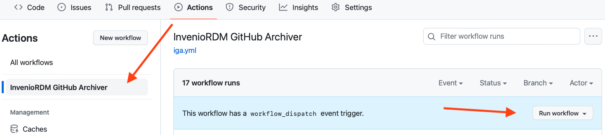
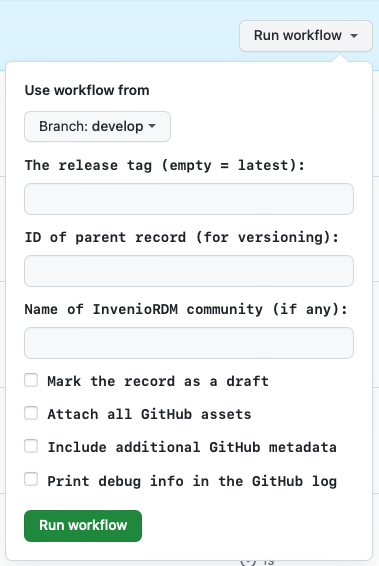
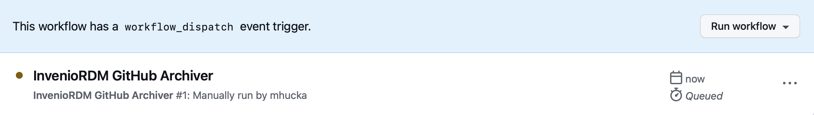
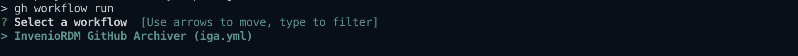
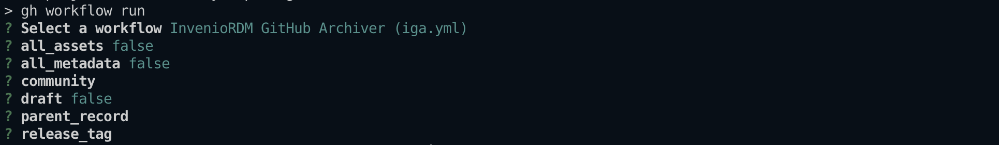
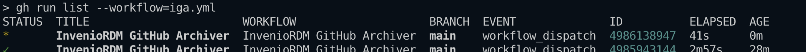

# Usage (GitHub Action)

After creating a GitHub Action workflow as described in [the installation instructions](installation.md#iga-as-a-github-action) (making sure to set the value of `INVENIO_SERVER` in the `.yml` file) and storing your InvenioRDM token as [a GitHub "secret" in the repository](quick-start.md#configuring-a-github-action), the workflow should run automatically the next time you make a release. The IGA workflow can also be run manually; in addition, the trigger condition(s) and some IGA options can be set by editing the workflow definition `.yml` file.

## Manual invocation

You can run the IGA GitHub Action workflow manually in two ways: from the web page of your GitHub repository, and using GitHub's `gh` command line tool.

### Manual workflow invocation on GitHub

1. Go to the _Actions_ tab in your repository and click on the name of the workflow in the sidebar on the left<figure></figure>
2. Click the <kbd>Run workflow</kbd> button shown above in the right-hand side of the blue strip.
3. A form will appear; in this form, you can set the IGA input parameters, including the tag of the release to send to InvenioRDM, whether to make the release a draft, and more. All these opotions except the first (the release tag) correspond to the [input parameters](#input-parameters) described below. The release tag is normally obtained automatically by virtue of the fact that IGA runs when a new release is made, but when running the workflow manually, you can provide a tag explicitly. If you leave it blank, IGA will use the latest release in the repository.<figure></figure>
4. Click the green <kbd>Run workflow</kbd> button near the bottom
5. Refresh the web page and a new line will be shown named after your workflow file<figure></figure>
6. Click that line to see the IGA workflow progress and results

### Manual workflow invocation using `gh`

The very handy GitHub command-line utility [`gh`](https://cli.github.com) lets you start workflows on GitHub from the comfort of your computer. To use it, in a shell go to your local clone of your repository, then run the folowing command:
```shell
gh workflow run
```

The `gh` command will next ask you to select a workflow to run if you have more than one defined for your repository. If IGA is the only one you have, you merely need to press the return key to select it:
<figure></figure>

You will be prompted for values of the options/input parameters (the same as in the form shown when running the action manually on GitHub).
<figure></figure>

One you hit return, you can monitor the status of the run using the command
```shell
gh run list --workflow=iga.yml
```
<figure></figure>


## Trigger condition(s)

The trigger condition for automatically running IGA on GitHub is determined by the `.yml` workflow file, specifically in the section with the `on:` heading. The workflow file shown in [the installation instructions](installation.md#iga-as-a-github-action) has an `on:` section that defines two triggers, one for release events on the repository and the other (the one titled `workflow_dispatch`) for manual invocation of the workflow. The relevant section of the file looks like this:
```yaml
on:
  release:
    types: [published]
  workflow_dispatch:
    ...
```

You can change the trigger condition if necessary, for example to set which branch of your repository is used to trigger the release archiving workflow. Please consult the [GitHub documentation on event triggers](https://docs.github.com/en/actions/using-workflows/triggering-a-workflow#using-events-to-trigger-workflows) for more information about what's possible.


## Input parameters

The Github Action for IGA has a number of configuration options that can be set using input parameters. These input parameters can be set in the workflow configuration `.yml` file.

### `INVENIO_SERVER` (default: no value)

This variable holds the address of the InvenioRDM server where records are created by IGA. In the example workflow shown [in the Installation instructions](installation.md#iga-as-a-github-action), the value of `INVENIO_SERVER` is set by writing it in the `.yml` file.

### `INVENIO_TOKEN` (default: no value)

This must be stored as a "secret" in the GitHub repository. It holds your [InvenioRDM personal access token (PAT)](quick-start.md#getting-an-inveniordm-token). 

### `all_assets` (default: false)

By default, IGA attaches to the InvenioRDM record _only_ the ZIP file asset created by GitHub for the release. To make IGA attach all assets associated with the GitHub release, set the `all_assets` option to true.

### `all_metadata` (default: false)

IGA tries to use [`CodeMeta.json`](https://codemeta.github.io) first and [`CITATION.cff`](https://citation-file-format.github.io) second to fill out the fields of the InvenioRDM record. If neither of those files are present, IGA uses values from the GitHub repository instead. You can make it always use all sources of info by setting the option `all_metadata` to `true`. Depending on how complete and up-to-date your `CodeMeta.json` and `CITATION.cff` are, this may or may not make the record more comprehensive and may or may not introduce redundancies or unwanted values.

### `community` (default: none)

To submit your record to a community, use the `community` option and set its value to the name of a community on your InvenioRDM server. Note that submitting a record to a community means that the record will not be finalized and will not be publicly visible when IGA finishes; instead, the record URL that you receive will be for a draft version, pending review by the community moderators.

### `draft` (default: false)

If the `community` option is not used, then by default, IGA will finalize and publish the record. To make it stop short and leave the record as a draft instead, set the option `draft` to `true`. The draft option also takes precedence over the community option: if you use both `draft` and `community`, IGA will stop after creating the draft record and will _not_ submit it to the community.  (You can nevertheless submit the record to a community manually once the draft is created, by visiting the record's web page and using the InvenioRDM interface there.)

### `parent_record` (default: none)

The option `parent_record` can be used to indicate that the record being constructed is a new version of an existing record. This will make IGA use the InvenioRDM API for [record versioning](https://inveniordm.docs.cern.ch/releases/versions/version-v2.0.0/#versioning-support). The newly-created record will be linked to a parent record identified by the value passed to `parent-record`. The value must be either an InvenioRDM record identifier (which is a sequence of alphanumeric characters of the form _XXXXX-XXXXX_, such as `bknz4-bch35`, generated by the InvenioRDM server), or a URL to the landing page of the record in the InvenioRDM server. (Note that such URLs end in the record identifier.)

### `release_tag` (default: latest release)

Normally, the GitHub Action is intended to be triggered by the latest release. When running the workflow manually, it can be useful to be able to specify a particular release tag (for example, when sending older release to the InvenioRDM server). The value of this option should be the tag name; e.g., `v1.2.3`.


### `debug` (default: false)

Turning on debugging will add more data into the GitHub Action workflow record. This is useful when debugging problems in IGA. For the GitHub Action workflow, the behavior is slightly different from the command-line version: the normal mode for the GitHub Action is the equivalent of `verbose` mode in the command-line version of IGA, and while `debug` mode adds more info to the output, it will (understandably) not cause IGA to drop into the `pdb` debugger upon errors.
