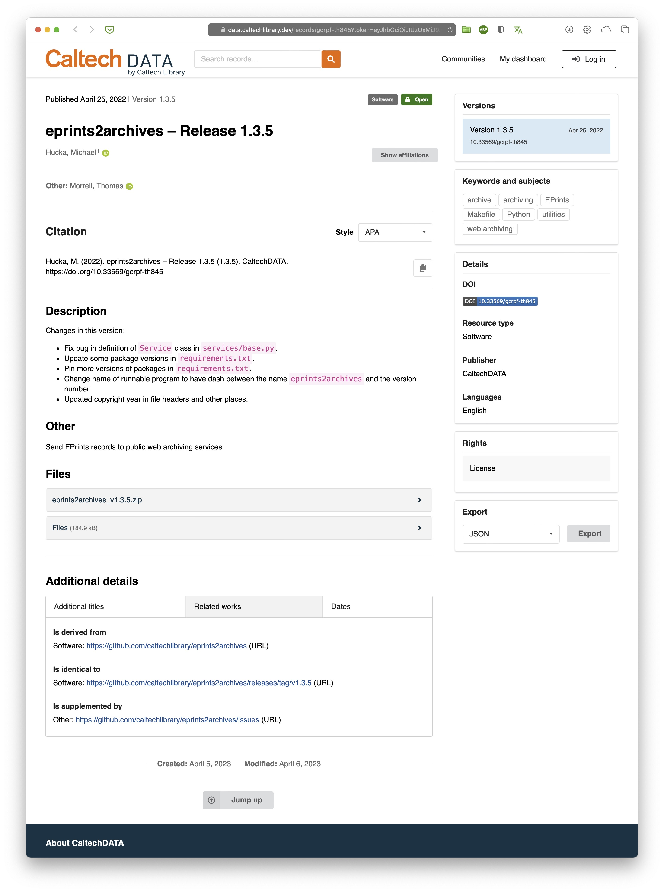
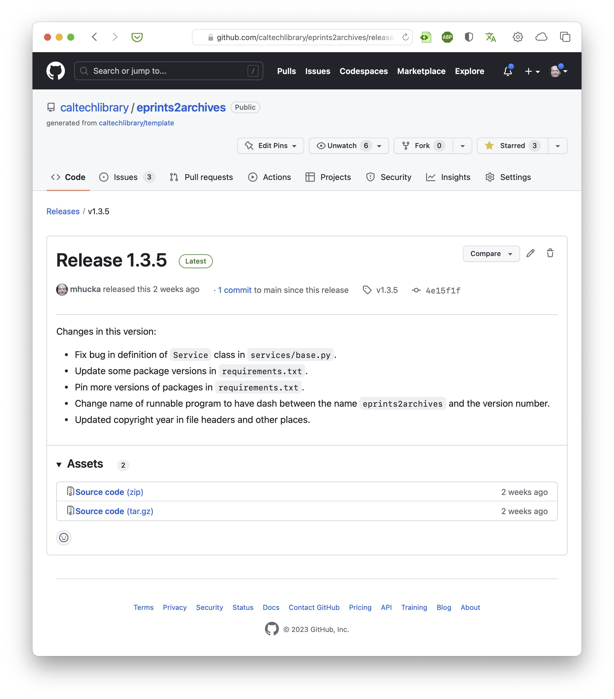

# Introduction

[InvenioRDM](https://inveniordm.docs.cern.ch) is a turn-key [research data management](https://riojournal.com/article/56508/) (RDM) platform that can be used by institutions to create repositories where data and software can be stored in order ensure long-term access to research products. Institutions such as Caltech use InvenioRDM as the basis for institutional repositories. [CaltechDATA](https://data.caltech.edu) is an example of an InvenioRDM-based repository; it enables researchers to upload research data and software, link data with their publications, and assign permanent [DOI](https://en.wikipedia.org/wiki/Digital_object_identifier)s to them so that other people can reference them.

The _InvenioRDM GitHub Archiver_ (IGA) is a tool for sending software releases from [GitHub](https://github.com/about) to an InvenioRDM-based repository server. IGA can be invoked from the command line; it also can be set up as a [GitHub Action](https://docs.github.com/en/actions) to automate the archiving of GitHub software releases in an InvenioRDM repository. Here are some of IGA's other notable features:
* Automatic extraction of metadata from the GitHub release, the GitHub repository, and [`codemeta.json`](https://codemeta.github.io) and/or [`CITATION.cff`](https://citation-file-format.github.io) files if they exist in the repository
* Thorough coverage of [InvenioRDM record metadata](https://inveniordm.docs.cern.ch/reference/metadata) using painstaking procedures
* Automatic recognition of common identifier types that often appear CodeMeta and CFF files, such as [ORCID](https://orcid.org), [ROR](https://ror.org), [DOI](https://www.doi.org), [arXiV](https://arxiv.org), [PMCID/PMID](https://www.ncbi.nlm.nih.gov/pmc/about/public-access-info/), and others
* Automatic lookup of human names in [ORCID.org](https://orcid.org) if needed (assuming ORCID id's are provided)
* Automatic lookup of organization names in [ROR](https://ror.org) (assuming ROR id's are provided)
* Automatic lookup of publication data in [DOI.org](https://www.doi.org), [PubMed]((https://www.ncbi.nlm.nih.gov/pmc/about/public-access-info/)), Google Books, & other sources if needed
* Automatic splitting of human names into family and given names using [ML](https://en.wikipedia.org/wiki/Machine_learning)-based methods, if necessary, to comply with InvenioRDM requirements
* Support for overriding the metadata record it creates, for complete control if you need it
* Support for InvenioRDM [communities](https://invenio-communities.readthedocs.io/en/latest/)
* Ability to use the GitHub API without a [GitHub access token](https://docs.github.com/en/authentication/keeping-your-account-and-data-secure/creating-a-personal-access-token) in many cases
* Extensive use of logging so you can see what's going on under the hood


## InvenioRDM records

Data and software archived in a repository need to be described well and richly cross-referenced in order to be widely discoverable by other people. The metadata records needed by InvenioRDM are expressed in a common file format ([JSON](https://www.json.org)), with required metadata fields [defined by InvenioRDM](https://inveniordm.docs.cern.ch/reference/metadata/). The record fields store information about the creators of the software (or data), distribution rights, titles, funding sources, publications, and more; InvenioRDM formats the metadata records as attractive web pages for human consumption. To give an example, below is a screenshot of the page for a software project stored in [CaltechDATA](https://data.caltech.edu):

<figure>
    
    <figcaption>Example of a landing page for a record in CaltechDATA.</figcaption>
</figure>

The metadata contained in the record of a deposit is critical, but it can be tedious and error-prone to enter by hand.  This is where automation such as IGA come in: _IGA can save users the trouble of depositing software and filling out the metadata record in InvenioRDM by performing all the steps automatically._


## GitHub releases

Although IGA can be used to produce arbitrary records in InvenioRDM repositories, it's focused on automating the process of creating records for GitHub software releases.

A [_release_ in GitHub](https://github.blog/2013-07-02-release-your-software/) is the mechanism by which users can package up a specific version of their software in a way that makes it easy for other users to obtain a copy. Releases are associated with individual repositories and are identified by [git tags](https://git-scm.com/book/en/v2/Git-Basics-Tagging); they can contain source code archives (e.g., in [ZIP](https://en.wikipedia.org/wiki/ZIP_(file_format)) format), release notes, and binary assets such as compiled executables. Below is the GitHub release page for the record shown in the previous figure.

<figure>
    
    <figcaption>The page in GitHub describing the release shown archived in InvenioRDM in the previous figure.</figcaption>
</figure>

You may be asking yourself "but … if the releases are already stored in GitHub, why bother storing them elsewhere?" There are at least two reasons:
1. GitHub is not an archive. Repositories can be renamed or deleted (intentionally or accidentally), as can user accounts; moreover, the contents of releases can also be edited and changed. In other words, _what is available on GitHub today may not be available there tomorrow_. Preservation of software products demands an archiving approach capable of retaining immutable copies of software in a form that can outlive individual projects and people.
2. Compliance with open data requirements. Many funding agencies and institutions require that research projects ensure free access to research products. Institutional repositories are specifically designed to support the needs of researchers in complying with funder or publisher data requirements. _Institutional repositories provide features that GitHub does not_, such as assigning globally-unique, _permanent_, citable identifiers (such as [DOI](https://en.wikipedia.org/wiki/Digital_object_identifier)s) for data and software.


## CodeMeta and CITATION.cff

GitHub by itself only records relatively sparse metadata about software releases and users associated with them. Thankfully, two efforts in recent years provide the means for software authors to describe software projects in more detail: [CodeMeta](https://codemeta.github.io) and [CITATION.cff](https://citation-file-format.github.io). Both are becoming increasingly well-known, especially among research software developers. To give a sense for what a `codemeta.json` file looks like, here is the one for the software release shown above:

```json
{
  "@context": "https://doi.org/10.5063/schema/codemeta-2.0",
  "@type": "SoftwareSourceCode",
  "description": "Send EPrints records to public web archiving services",
  "name": "eprints2archives",
  "codeRepository": "https://github.com/caltechlibrary/eprints2archives",
  "issueTracker": "https://github.com/caltechlibrary/eprints2archives/issues",
  "license": "https://github.com/caltechlibrary/eprints2archives/blob/master/LICENSE",
  "version": "1.3.5",
  "author": [
    {
      "@type": "Person",
      "givenName": "Michael",
      "familyName": "Hucka",
      "affiliation": "Caltech Library",
      "email": "mhucka@caltech.edu",
      "@id": "https://orcid.org/0000-0001-9105-5960"
    },
],
  "developmentStatus": "active",
  "downloadUrl": "https://github.com/caltechlibrary/eprints2archives/archive/master.zip",
  "keywords": [
    "EPrints",
    "archive",
    "web archiving",
    "archive"
  ],
  "maintainer": "https://orcid.org/0000-0001-9266-5146",
  "programmingLanguage": "Python"
}
```

IGA looks for `codemeta.json` and `CITATION.cff` files in a repository and uses the information found therein as the primary bases for constructing InvenioRDM metadata records. If a repository contains neither file, IGA resorts to using only the metadata provided by GitHub for the release and the associated repository.


## IGA's operation
